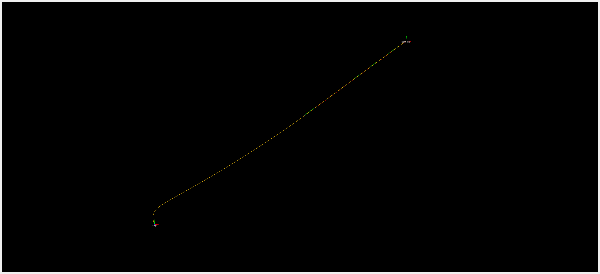
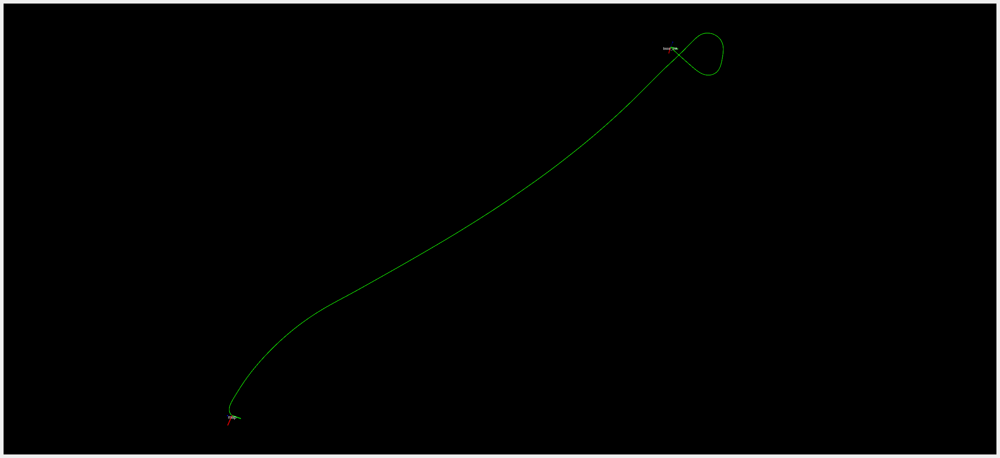

# Multi Sensor Fusion (MSF) Localization

**Multi Sensor Fusion Localization using Kalman Filters**

A modular C++/ROS 2 localization framework for estimating robot/vehicle state by combining measurements from multiple sensors using Kalman-filter-based state estimation.

The project is designed with a separation between the **localization/estimation core** and the **ROS 2 interface**, making the estimation algorithms reusable outside of ROS 2.

[](https://docs.ros.org/en/humble/)
[](https://ubuntu.com/)
[](https://en.cppreference.com/)
[](LICENSE)

---

## Overview

Modern autonomous vehicles and mobile robots typically rely on several complementary sensors for localization.

For example:

- **IMU** provides high-rate motion information but accumulates drift.
- **GNSS** provides globally referenced position but may be noisy or temporarily unavailable.
- **Wheel odometry** provides high-rate relative motion information from wheel encoders. It is particularly useful for estimating vehicle velocity and short-term motion, but can accumulate error due to wheel slip, uneven terrain, encoder noise, and inaccurate wheel parameters.
- **LiDAR odometry** provides relative motion information but is affected by environmental conditions and accumulated drift.
- **Visual odometry** provides motion estimates from camera observations but can fail in challenging visual environments.

Multi-sensor fusion combines these measurements into a single state estimate that is generally more robust than relying on an individual sensor.

This project provides a framework for implementing and experimenting with such localization algorithms using **Kalman filtering and state estimation techniques**.

---

## Architecture

The project is divided into two main components:

```text
msf_localization/
├── msf_localization_core/
│   ├── apps/
│   ├── include/
│   │   └── filters/
│   ├── src/
│   │   └── filters/
│   └── CMakeLists.txt
│
├── msf_localization_ros2/
│   ├── config/
│   ├── include/
│   │   └── msf_localization_ros2/
│   ├── launch/
│   ├── rviz/
│   ├── src/
│   ├── CMakeLists.txt
│   └── package.xml
│
├── LICENSE
└── README.md
```

The repository currently contains a dedicated `msf_localization_core` package for the estimation algorithms and an `msf_localization_ros2` package containing the ROS 2 integration, launch files, configuration and RViz resources. 

### `msf_localization_core`

The core library contains the localization and filtering logic.

Its purpose is to remain independent from ROS-specific message types and communication mechanisms wherever possible.

This makes it possible to use the estimation algorithms in:

- ROS 2 nodes
- standalone C++ applications
- simulation environments
- offline dataset processing
- unit tests and research experiments

### `msf_localization_ros2`

The ROS 2 package provides the interface between the estimation core and the ROS ecosystem.

It contains:

- ROS 2 node implementation
- configuration files
- launch files
- RViz configuration
- ROS 2 publishers/subscribers

---

## Supported Filters

### Linear Kalman Filter (LKF)

<p align="center">
  
</p>

<table>
  <tr>
    <td align="center">
      
      <br />
      <b>Kitti 2011_09_26_0014 result for LKF</b>
    </td>
    <td align="center">
      
      <br />
      <b>Kitti 2011_10_03_0042 result for LKF</b>
    </td>
  </tr>
</table>

---

## Requirements

- ROS2 Humble
- Eigen
- GeographicLib

---

## Installation & Build

Clone the repository:

```bash
git clone -b humble-dev https://github.com/aliaydinkucukcollu/msf_localization.git
cd msf_localization
```

Source ROS 2 Humble:

```bash
source /opt/ros/humble/setup.bash
```

Build the workspace:

```bash
colcon build --cmake-args -DCMAKE_EXPORT_COMPILE_COMMANDS=ON
```

---

## Running

Launch the ROS 2 localization node with:

```bash
source /opt/ros/humble/setup.bash
source install/setup.bash

ros2 launch msf_localization_ros2 msf_localization_ros2.launch.py
```

The ROS 2 package contains dedicated directories for configuration, launch files and RViz visualization.

---

## Design Goals

The project is being developed around several goals.

### 1. Modular Estimation Algorithms

Filtering algorithms should be independent of the ROS 2 interface.

```text
                ┌────────────────────┐
                │ Localization Core  │
                │                    │
                │  Kalman Filters    │
                │  State Models      │
                │  Measurement Models│
                └─────────▲──────────┘
                          │
                          │
                ┌─────────┴──────────┐
                │      ROS 2         │
                │                    │
                │ Subscribers        │
                │ Publishers         │
                │ Parameters         │
                │ Launch             │
                └────────────────────┘
```

### 2. Sensor Independence

The estimator should be capable of incorporating measurements from different sensor sources without tightly coupling the filtering implementation to a particular sensor driver.

### 3. Research and Development

The project is intended to make it straightforward to experiment with different:

- State representations
- Motion models
- Measurement models
- Kalman-filter variants
- Noise models
- Sensor combinations

### 4. Autonomous Vehicle Applications

The framework is particularly suitable for robotics and autonomous-vehicle localization research where GNSS, IMU and relative odometry sources need to be combined.

---

## License

This project is licensed under the **MIT License**.

See [LICENSE](LICENSE) for details.

---

## Author

**Ali Aydın Küçükçöllü**

---

## Acknowledgements

This project is developed as an educational and research-oriented framework for understanding and implementing multi-sensor state estimation techniques for robotics and autonomous vehicles.

---

## References

- Probabilistic Robotics
Sebastian Thrun, Wolfram Burgard, Dieter Fox.
MIT Press, 2005.

- State Estimation for Robotics
Timothy D. Barfoot.
Cambridge University Press, 2017.

---

**If you find this project useful, consider giving it a ⭐ on GitHub.**